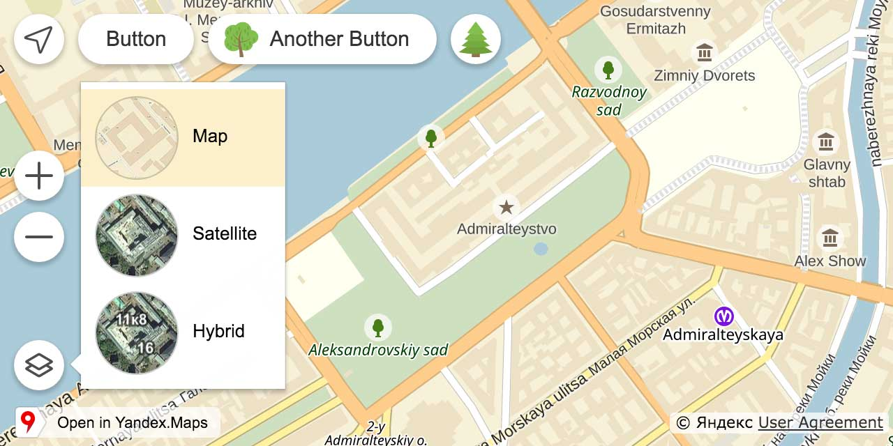

# Round map controls theme
## Plugin for Yandex.Maps JS API



## Demo
http://yandex.github.io/mapsapi-round-controls/

## How to use?

1. Download the source code: [`build/release/all.js`](build/release/all.js).
2. Add it to your page below Yandex.Maps JS API `<script>` tag.
3. Create controls with `round#`... layout keys.

## Available layouts:
 
### Button

| Param                        | Value
| ---------------------------- | ----------------------------------
| `parameters.options.layout`  | `round#buttonLayout`
| `parameters.data.iconType`   | [List of available icons](docs/icons.md)  
| `parameters.data.image`      | Icon URL


```js
// Preset icon image.
var button = new ymaps.control.Button({
    data: {
        iconType: 'loupe',
        title: 'Button Text'
    },
    options: {
        layout: 'round#buttonLayout',
        maxWidth: 120
    }
});
myMap.controls.add(button);
```

```js
// Custom icon image.
var button = new ymaps.control.Button({
    data: {
        image: 'path_to/image.svg',
        title: 'Button Text'
    },
    options: {
        layout: 'round#buttonLayout',
        maxWidth: 120
    }
});
myMap.controls.add(button);
```

For more info visit https://tech.yandex.ru/maps/doc/jsapi/2.1/ref/reference/control.Button-docpage/


### GeolocationControl

| Param                        | Value
| ---------------------------- | --------------------
| `parameters.options.layout`  | `round#buttonLayout`

```js
var geolocationControl = new ymaps.control.GeolocationControl({
    options: {
        layout: 'round#buttonLayout'
    }
});
myMap.controls.add(geolocationControl);
```

For more info visit https://tech.yandex.ru/maps/doc/jsapi/2.1/ref/reference/control.GeolocationControl-docpage/

### RulerControl

| Param                        | Value
| ---------------------------- | --------------------
| `parameters.options.layout`  | `round#rulerLayout`

```js
var rulerControl = new ymaps.control.RulerControl({
    options: {
        layout: 'round#rulerLayout'
    }
});
myMap.controls.add(rulerControl);
```

For more info visit  https://tech.yandex.ru/maps/doc/jsapi/2.1/ref/reference/control.RulerControl-docpage/

### TypeSelector

| Param                                      | Value
| ------------------------------------------ | --------------------
| `parameters.options.layout`                | `round#listBoxLayout`
| `parameters.options.itemLayout`            | `round#listBoxItemLayout`
| `parameters.options.itemSelectableLayout`  | `round#listBoxItemSelectableLayout`


```js
// TypeSelector on the left side.
var typeSelector = new ymaps.control.TypeSelector({
    options: {
        layout: 'round#listBoxLayout',
        itemLayout: 'round#listBoxItemLayout',
        itemSelectableLayout: 'round#listBoxItemSelectableLayout',
        float: 'none',
        position: {
            bottom: '40px',
            left: '10px'
        }
    }
});
myMap.controls.add(typeSelector);
```

```js
// TypeSelector on the right side.
var typeSelector = new ymaps.control.TypeSelector({
    options: {
        layout: 'round#listBoxLayout',
        itemLayout: 'round#listBoxItemLayout',
        itemSelectableLayout: 'round#listBoxItemSelectableLayout',
        float: 'none',
        position: {
            bottom: '40px',
            right: '10px'
        }
    }
});
myMap.controls.add(typeSelector);
```

For more info visit https://tech.yandex.ru/maps/doc/jsapi/2.1/ref/reference/control.TypeSelector-docpage/

### ZoomControl

| Param                        | Value
| ---------------------------- | --------------------
| `parameters.options.layout`  | `round#zoomLayout`

```js
var zoomControl = new ymaps.control.ZoomControl({
    options: {
        layout: 'round#zoomLayout'
    }
});
myMap.controls.add(zoomControl);
```

For more info visit https://tech.yandex.ru/maps/doc/jsapi/2.1/ref/reference/control.ZoomControl-docpage/


## Building
Use [ymb](https://www.npmjs.org/package/ymb) if re-build is needed.
