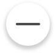
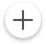
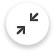

# Icons

### Example
```js
var button = new ymaps.control.Button({
    data: {
        iconType: 'cross'
    },
    options: {
        layout: 'round#buttonLayout'
    }
});
```
### Icons List
 
| Preview                                                        | `parameters.data.iconType` Value
| -------------------------------------------------------------- | ---------------------------------
|         | `'cross'`
|   | `'geolocation'`
|        | `'layers'`
|         | `'loupe'`
|          | `'pano'`
|         | `'ruler'`
|        | `'routes'`
|       | `'traffic'`
|         | `'minus'`
|          | `'plus'`
|      | `'collapse'`
|        | `'expand'`
|    | `'h-collapse'`
|      | `'h-expand'`
